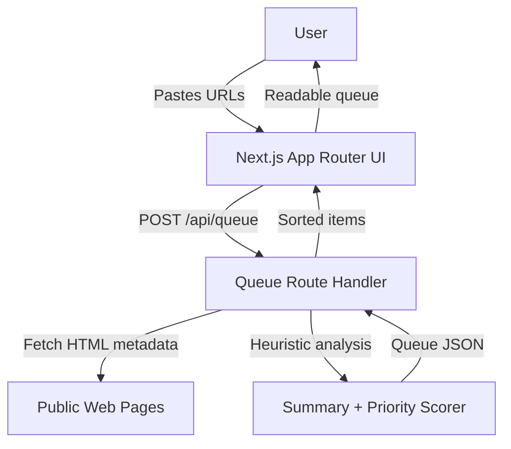

# Quiet Queue

A tiny web app that turns a messy browser tab list into a calm, prioritized reading queue. Paste URLs, and Quiet Queue fetches available page metadata, generates a lightweight heuristic summary and priority score, then displays a sorted reading queue.

## Architecture



## Core feature

- Paste one or more URLs (one per line, or separated by spaces/commas)
- App normalizes URLs and fetches page HTML where possible
- Extracts title, description, and text snippets from meta tags / headings
- Generates a short summary and a priority score from heuristics
- Displays items sorted from highest to lowest priority

No LLM key is required for this MVP. The summarization and scoring are deterministic local heuristics, so it runs fully offline except for optional page fetching.

## Requirements

- Node.js 18+
- npm

## Run locally

```bash
cd brain-quiet-queue
npm install
npm run dev
```

Open http://localhost:3000

## Build / production run

```bash
npm run build
npm start
```

## Smoke test

```bash
npm run smoke
```

## Environment variables

Copy `.env.example` to `.env.local` if you want to customize behavior.

| Variable | Default | Description |
| --- | --- | --- |
| `FETCH_TIMEOUT_MS` | `4500` | Timeout for fetching URL metadata in milliseconds. |
| `MAX_URLS_PER_QUEUE` | `20` | Maximum number of URLs accepted in one paste. |

## Notes

- Some websites block server-side fetches. Quiet Queue still includes the URL in the queue and falls back to URL-derived titles and summaries.
- Data is not persisted in this MVP; each generated queue exists in the browser response only.
